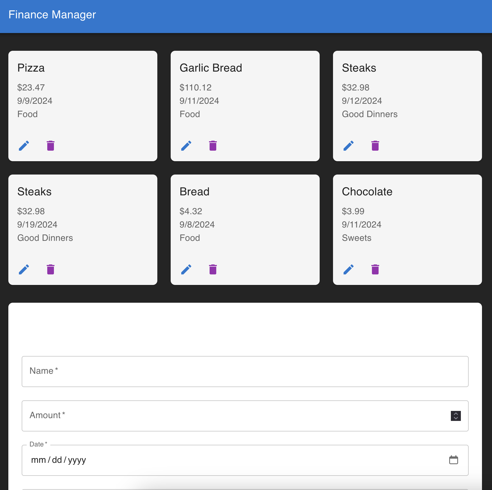

## Screenshots

Screenshot of the Finance Manager application:



# Finance Manager

Finance Manager is a web application designed to help users manage their expenses effectively. Users can add, edit, and delete expenses while also tracking recurring expenses with customizable recurrence intervals. The app is built using a React frontend with Material-UI for styling and a C# .NET backend with a PostgreSQL database for data storage.

## Features

- **Add, Edit, and Delete Expenses:** Easily manage your financial records by adding, editing, or deleting expenses.
- **Recurring Expenses:** Set up recurring expenses with intervals such as daily, weekly, monthly, or yearly.
- **Category Management:** Choose from predefined categories or create custom categories for your expenses.
- **Responsive Design:** The application is designed to work on both desktop and mobile devices with a modern UI using Material-UI.

## Tech Stack

- **Frontend:** React, TypeScript, Material-UI
- **Backend:** ASP.NET Core, C#
- **Database:** PostgreSQL
- **API Communication:** Axios

## Prerequisites

Before running the application, make sure you have the following installed:

- **Node.js** (>=14.x)
- **.NET SDK** (>=6.0)
- **PostgreSQL** (>=13.x)

## Setup Instructions

### Backend (API)

1. **Clone the repository:**

   ```bash
   git clone https://github.com/AkALoPy/FinanceManager.git
   cd FinanceManager/FinanceManagerApi

### Set up the PostgreSQL database:

    Create a new PostgreSQL database.
    Update the connection string in appsettings.json to match your database configuration.

### Run the migrations to set up the database schema:

    bash

        dotnet ef database update

    Run the backend server:

    bash

        dotnet run

    The backend API should now be running on http://localhost:5086. 

## Frontend (Client)

    Navigate to the client directory

    bash

        cd finance-manager-client

## Install dependencies:

    bash

        npm install

## Start the React development server:

    bash

        npm start

The frontend should now be running on http://localhost:5173.


### Environment Variables

To run the project in different environments, set up the following environment variables in a .env file in the root of your client and API projects:

    API Base URL: REACT_APP_API_BASE_URL

    Example .env file for the client

    REACT_APP_API_BASE_URL=http://localhost:5173/api